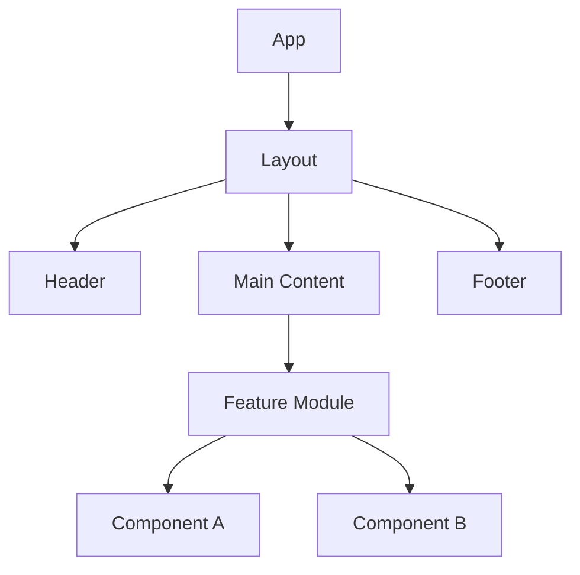
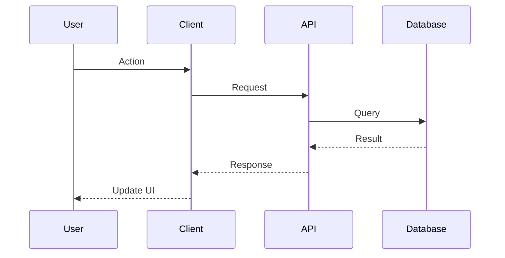

# SKILL: Architecture Patterns

## When to Use
When @sa designs system architecture, evaluates technical approaches, or reviews @dev's code for architectural compliance.

## Pattern Catalog

### Frontend Patterns

#### Component-Based Architecture
- Break UI into small, reusable components.
- Each component owns its markup, styles, and local state.
- Props down, events up. No direct parent mutation.
```
App → Layout → Page → Section → Component → Element
```

#### Container/Presenter Pattern
- **Container (Smart):** Handles data fetching, state, and business logic.
- **Presenter (Dumb):** Receives props, renders UI. No side effects.
- Enables easy testing and reuse of presenters.

#### State Management
- **Local state:** Component-level (`useState`, `ref`).
- **Shared state:** Context/Store for cross-component data.
- **Server state:** React Query / SWR for API data with caching.
- **Rule:** Keep state as close to where it's used as possible.

### Backend Patterns

#### Clean Architecture (Layered)
```
Controller → Service → Repository → Database
 ↓ ↓ ↓
 Input Business Data
 Handling Logic Access
```
- Dependencies point inward (outer layers depend on inner).
- Business logic has ZERO dependency on framework or database.

#### Event-Driven
- Components communicate via events/messages.
- Loose coupling, high scalability.
- Use for: notifications, analytics, audit logging.

#### API Design
- RESTful: resource-based URLs, HTTP verbs, status codes.
- GraphQL: When clients need flexible queries.
- Document all endpoints in `docs/tech/API_CONTRACTS.md`.

### Cross-Cutting Patterns

#### Error Handling Strategy
```
User Input Error → Validation layer → 400 response with details
System Error → Try/catch → Log → 500 response with safe message
External Error → Retry with backoff → Circuit breaker → Fallback
```

#### Caching Strategy
- **Browser cache:** Static assets with hash-based filenames.
- **API cache:** HTTP cache headers (ETag, Cache-Control).
- **Application cache:** In-memory for computed values.
- **Rule:** Cache close to the consumer, invalidate on mutation.

## Decision Framework

When choosing between patterns, evaluate:

| Criteria | Weight | Notes |
|---|---|---|
| **Simplicity** | High | Prefer the simplest pattern that solves the problem |
| **Scalability** | Medium | Will this pattern work at 10x scale? |
| **Testability** | High | Can each layer be tested independently? |
| **Team Familiarity** | Medium | Does the team know this pattern? |
| **Maintainability** | High | Can a new developer understand this in 30 min? |

## Mermaid Diagram Templates

### Component Diagram


### Sequence Diagram


### ADR (Architectural Decision Record) Template
```markdown
# ADR-[NNN]: [Title]
**Date:** YYYY-MM-DD | **Status:** Proposed | Accepted | Deprecated

## Context
[What is the issue or decision we need to make?]

## Decision
[What did we decide?]

## Consequences
- [Positive consequence]
- [Risk or tradeoff]
- [Negative consequence]
```
