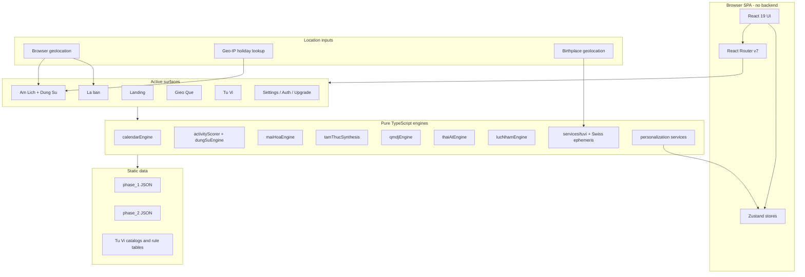
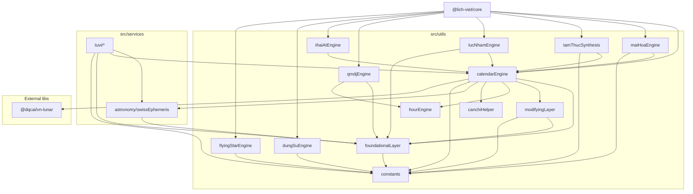

# Technical Architecture - Lich Viet v3

> **Version:** 3.0.0 | **Updated:** May 2026
> Source of truth for the current local codebase.

---

## 1. Overview

Lich Viet v3 is a browser-only React SPA. There is no backend server in this repository. The app is structured as `UI -> State -> Engine`, with all calculation work running in TypeScript inside the browser.

The active product surfaces are:

- Landing
- Am Lich + Dung Su
- La bàn
- Gieo Que
- Tu Vi
- Support routes for settings, auth, and upgrade

The current codebase adds two important location-aware flows:

- Am Lich uses browser geolocation to make live lunar/calendar calculations follow the viewer's location.
- La bàn uses phone sensor heading on supported mobile browsers and falls back to manual heading entry on unsupported devices.
- Tu Vi uses birthplace geolocation and Swiss ephemeris true-solar correction when the Swiss engine is ready.

There is no active Web Worker layer in the shipped codebase.

---

## 2. Technology Stack

| Layer | Technology | Version |
| --- | --- | --- |
| Framework | React + TypeScript | 19.2.4 + 5.9.3 |
| Build | Vite | 7.3.1 |
| Styling | Tailwind CSS v4 + vanilla CSS | 4.2.x |
| State | Zustand | 5.0.11 |
| Routing | React Router DOM | 7.13.1 |
| Validation | Zod | 4.3.6 |
| Testing | Vitest + Testing Library + JSDOM + Playwright | 4.0.18 + current |
| Linting | ESLint 9 flat config + Prettier 3 | 9.39.x + 3.8.x |
| PWA | vite-plugin-pwa | 1.2.x |

### Key External Libraries

| Library | Purpose |
| --- | --- |
| `@dqcai/vn-lunar` | Vietnamese lunar calendar fallback and comparison checks |
| `lunar-javascript` | Additional lunar calendar utilities |
| `@swisseph/browser` | High-precision astronomical ephemeris |
| `@swisseph/core` | Swiss ephemeris calculations and flags |

---

## 3. High-Level Architecture



### Data Flow Notes

1. Am Lich uses browser geolocation for viewer-local lunar calculations and the current-day shortcut.
2. La bàn consumes browser sensor data when available and keeps manual heading as the fallback path.
3. `useHolidays` still performs Geo-IP holiday lookup for country-specific holiday cards.
4. Tu Vi birth normalization keeps birthplace coordinates as the source of truth and adds Swiss true-solar correction when the Swiss engine is available.
5. Swiss ephemeris is the precision path; local lunar logic remains the fallback when WASM is not ready.

---

## 4. Source Layout

```text
src/
├── App.tsx                 # Root routing and app shell
├── components/             # Feature UI, pages, layout, shared components
│   ├── layout/             # AppNav, AppSidebar, MobileDrawer, AppFooter
│   ├── pages/              # Landing, auth, settings, upgrade
│   ├── Calendar/           # Calendar panels and holiday cards
│   ├── GieoQue/            # Divination surface
│   ├── FengShui/           # La bàn Phong Thủy surface
│   ├── MaiHoa/             # Mai Hoa UI
│   ├── TamThuc/            # Tam Thuc UI
│   ├── TuVi/               # Tu Vi UI and export flow
│   └── LichDungSu/         # Dung Su UI
├── config/                 # API, scoring, and theme config
├── data/                   # Static JSON datasets
├── hooks/                  # React hooks used across the app
├── i18n/                   # Locale helpers and translations
├── router/                 # Route definitions and redirects
├── services/               # Analytics, astronomy, Tu Vi, personalization
├── stores/                 # Zustand app/auth/Tu Vi state
├── types/                  # Shared TypeScript declarations
└── utils/                  # Core calculation engines and helpers

packages/
├── core/                   # `@lich-viet/core` engine exports
└── types/                  # `@lich-viet/types` shared type exports

test/
├── engines/                # Engine regression tests
├── services/               # Service tests
├── stores/                 # Store tests
└── utils/                  # Utility tests
```

---

## 5. Module Aliasing

Vite is configured with path aliases for clean imports:

| Alias | Target |
| --- | --- |
| `@/` | `src/` |
| `@lich-viet/core` | `packages/core/src/index.ts` |
| `@lich-viet/core/calendar` | `packages/core/src/calendar/index.ts` |
| `@lich-viet/core/dungsu` | `packages/core/src/dungsu/index.ts` |
| `@lich-viet/core/maihoa` | `packages/core/src/maihoa/index.ts` |
| `@lich-viet/core/fengshui` | `packages/core/src/fengshui/index.ts` |
| `@lich-viet/core/qmdj` | `packages/core/src/qmdj/index.ts` |
| `@lich-viet/core/thaiAt` | `packages/core/src/thaiAt/index.ts` |
| `@lich-viet/core/lucNham` | `packages/core/src/lucNham/index.ts` |
| `@lich-viet/core/tamThuc` | `packages/core/src/tamThuc/index.ts` |
| `@lich-viet/types` | `packages/types/src/index.ts` |

There is no `@lich-viet/core/tuvi` barrel in the current codebase. Tu Vi code lives under `src/services/tuvi/` and `src/components/TuVi/`.

---

## 6. Engine Catalog

| # | Engine | File(s) | Input | Output |
| --- | --- | --- | --- | --- |
| 1 | Calendar | `src/utils/calendarEngine.ts` | Solar date + optional viewer location | Lunar date, Can Chi, day detail, hours |
| 2 | Activity Scoring | `src/utils/activityScorer.ts` | Date + activity | Weighted score from evaluation layers |
| 3 | Dung Su | `src/utils/dungSuEngine.ts`, `src/utils/dungSuSuggester.ts` | Date + activity | Activity grouping and recommendations |
| 4 | Mai Hoa | `src/utils/maiHoaEngine.ts`, `src/utils/maiHoaInterpreter.ts` | Time or numbers | Hexagram triplet + interpretation |
| 5 | QMDJ | `src/utils/qmdjEngine.ts`, `src/utils/qmdjScorer.ts` | Date + activity | Nine-palace chart and scoring helpers |
| 6 | Thai At | `src/utils/thaiAtEngine.ts` | Year or date | Thai At year and month overlays |
| 7 | Luc Nham | `src/utils/lucNhamEngine.ts` | Date/time | Heaven/Earth board and verdicts |
| 8 | Tam Thuc | `src/utils/tamThucSynthesis.ts` | Date/time | QMDJ + Thai At + Luc Nham synthesis |
| 9 | Flying Star | `src/utils/flyingStarEngine.ts` | Period + direction | Flying Star Luo Shu grid |
| 10 | Swiss astronomy | `src/services/astronomy/swissEphemeris.ts` | Date + longitude + timezone | True-solar correction, lunar date, boundary warnings |
| 11 | Tu Vi | `src/services/tuvi/` | Birth data + birthplace location | Tu Vi chart, star placement, hạn context, export data |

---

## 7. Dependency Graph



### Data Flow Principles

1. Low-level utilities such as `constants` and `foundationalLayer` do not depend on higher-level engines.
2. `calendarEngine.ts` is the canonical source for solar-lunar conversion in the active app.
3. Swiss ephemeris is the precision path when available; the local algorithm remains the fallback.
4. Tu Vi birthplace normalization is separate from viewer geolocation and should remain so.

---

## 8. State Management

| Store | Key state | Purpose |
| --- | --- | --- |
| `useAppStore` | `selectedDate`, `dayData`, `viewerLocation`, theme, font size | Shared app state for the main shell and calendar |
| `useAuthStore` | Local auth/session/profile data | Demo-only auth and profile persistence |
| `useTuViStore` | Input, chart, selected palace, view year/month, errors | Tu Vi chart state and hạn navigation |

### Current App Store Contract

- `selectedDate` drives the active calendar/day-detail view.
- `dayData` is recomputed from `selectedDate` and the current viewer location.
- `viewerLocation` stores browser geolocation for calendar calculations.

---

## 9. Current Validation Baseline

Latest local validation in this workspace:

| Check | Status |
| --- | --- |
| TypeScript | `npm run typecheck` passes |
| Unit tests | `npm test` passes |
| Lint | `npm run lint` passes with one pre-existing warning in `src/components/DetailedDayView.tsx` |

---
