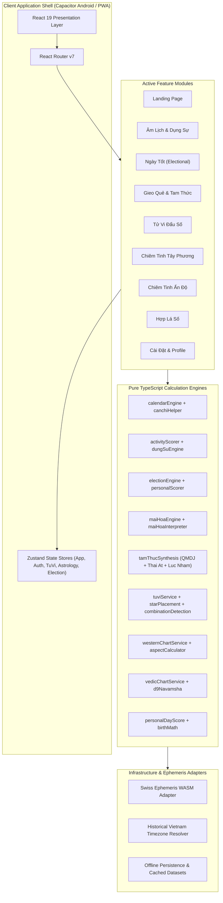

# Technical Architecture - Lich Viet v3

> **Version:** 3.1.0 | **Updated:** August 2026  
> Source of truth for the local codebase and modular architecture.

---

## 1. Overview

Lịch Việt is a high-performance, offline-first metaphysical computing application built as a browser SPA and packaged for mobile via Capacitor Android. All astronomical, astrological, calendar, and divination calculations run entirely on the client side in strict TypeScript.

### Active Product Surfaces:

- **Landing:** Standalone introduction, feature showcases, and quick intake.
- **Âm Lịch & Dụng Sự:** Solar/lunar calendar, Can Chi, Tiết Khí, Hoàng Đạo/Hắc Đạo, and personalized day auspiciousness scoring.
- **Ngày Tốt (Electional Astrology):** Auspicious date selection across custom date ranges, activity filters, and personal birth chart compatibility.
- **Gieo Quẻ & Tam Thức:** Divination suite combining Mai Hoa Dịch Số, Kỳ Môn Độn Giáp, Thái Ất Thần Kinh, and Đại Lục Nhâm.
- **Tử Vi Đẩu Số:** Full 12-palace astrological chart generation based on the classical Thiên Lương / Nam Phái traditions, true-solar time correction, and SVG export.
- **Chiêm Tinh Tây Phương (Western Natal & Transits):** High-precision planetary ephemeris, Placidus/Whole Sign houses, aspect matrices, and wheel visualization.
- **Chiêm Tinh Ấn Độ (Vedic & D9 Navamsha):** Sidereal Lahiri calculations, Nakshatras, and South/North Indian square chart layouts.
- **Hợp Lá Số (Synastry):** Cross-chart astrological compatibility and dual-wheel overlays.
- **Support & Settings:** Profile personalization, light/dark themes, offline PWA storage, and export management.

---

## 2. Technology Stack

| Layer | Technology | Version | Purpose |
| --- | --- | --- | --- |
| Framework | React + TypeScript | 19.2.x + 5.9.x | Component-driven UI and strict type safety |
| Build & Bundler | Vite | 7.3.x | Lightning-fast HMR and optimized production code-splitting |
| Styling | Tailwind CSS v4 + Vanilla CSS | 4.2.x | High-performance CSS-first styling and theme tokens |
| State Management | Zustand | 5.0.x | Lightweight, decoupled global application state |
| Routing | React Router DOM | 7.13.x | Client-side routing, route guards, and code-split lazy loading |
| Astronomical Ephemeris | `@swisseph/browser` + `@swisseph/core` | 1.1.x | High-precision planetary positions, true solar time, and solar terms |
| Export Engine | `html-to-image` | 1.11.x | Client-side vector SVG and high-resolution chart exports |
| Mobile Runtime | Capacitor Android | 8.3.x | Native Android WebView packaging, filesystem, and clipboard |
| Validation | Zod | 4.3.x | Schema-driven form validation and API contract assertions |
| Testing | Vitest + Testing Library + Playwright | 4.0.x / 1.58.x | 100% green unit, engine, component, and E2E testing |
| Code Quality | ESLint 9 (Flat Config) + Prettier 3 | 9.39.x / 3.8.x | Automated linting, accessibility checks, and format enforcement |

---

## 3. High-Level Architecture


```mermaid
graph TB
    subgraph ClientShell["Client Application Shell (Capacitor Android / PWA)"]
        direction TB
        UI["React 19 Presentation Layer"]
        Router["React Router v7"]
        Stores["Zustand State Stores (App, Auth, TuVi, Astrology, Election)"]
    end

    subgraph Surfaces["Active Feature Modules"]
        Landing["Landing Page"]
        AmLich["Âm Lịch & Dụng Sự"]
        NgayTot["Ngày Tốt (Electional)"]
        GieoQue["Gieo Quẻ & Tam Thức"]
        TuVi["Tử Vi Đẩu Số"]
        Western["Chiêm Tinh Tây Phương"]
        Vedic["Chiêm Tinh Ấn Độ"]
        Synastry["Hợp Lá Số"]
        Settings["Cài Đặt & Profile"]
    end

    subgraph DomainEngines["Pure TypeScript Calculation Engines"]
        Calendar["calendarEngine + canchiHelper"]
        DungSu["activityScorer + dungSuEngine"]
        Election["electionEngine + personalScorer"]
        MaiHoa["maiHoaEngine + maiHoaInterpreter"]
        TamThuc["tamThucSynthesis (QMDJ + Thai At + Luc Nham)"]
        TuViEng["tuviService + starPlacement + combinationDetection"]
        WesternEng["westernChartService + aspectCalculator"]
        VedicEng["vedicChartService + d9Navamsha"]
        Personal["personalDayScore + birthMath"]
    end

    subgraph Infrastructure["Infrastructure & Ephemeris Adapters"]
        Swiss["Swiss Ephemeris WASM Adapter"]
        TZ["Historical Vietnam Timezone Resolver"]
        Storage["Offline Persistence & Cached Datasets"]
    end

    UI --> Router --> Surfaces
    Surfaces --> Stores
    Surfaces --> DomainEngines
    DomainEngines --> Infrastructure
```

---

## 4. Engine & Module Directory Structure

```text
src/
├── components/             # UI Components (Feature-Sliced)
│   ├── Astrology/          # Western, Vedic, and Synastry views
│   ├── Calendar/           # Calendar grid, day cells, and holidays
│   ├── Election/           # Electional date picker and results
│   ├── GieoQue/            # Mai Hoa and divination views
│   ├── LichDungSu/         # Activity scoring UI
│   ├── MaiHoa/             # Mai Hoa trigram/hexagram renderers
│   ├── TamThuc/            # QMDJ, Thái Ất, Lục Nhâm panels
│   ├── TuVi/               # 12-palace grid and chart export
│   ├── layout/             # AppNav, AppSidebar, MobileDrawer, AppFooter
│   ├── pages/              # Landing, Auth, Settings, Upgrade
│   └── shared/             # Common buttons, cards, inputs, error boundary
├── config/                 # Application and theme configuration
├── data/                   # Static JSON datasets (hexagrams, stars, timezones)
├── hooks/                  # Custom React hooks (location, dark mode, titles)
├── i18n/                   # Localization helpers
├── router/                 # Routes, redirects, and constants
├── services/               # Specialized domain and orchestration services
│   ├── astronomy/          # Swiss Ephemeris wrapper and solar math
│   ├── personalization/    # Birth math and personalized scoring
│   ├── tuvi/               # Complete Tử Vi star placement and rules
│   ├── western/            # Western chart, aspect calculations, declinations
│   └── vedic/              # Vedic charts, D9 Navamsha, Nakshatras
├── stores/                 # Zustand state stores
├── types/                  # Shared TypeScript interfaces
└── utils/                  # Core calculation engines and math helpers

packages/
├── core/                   # `@lich-viet/core` engine exports
├── types/                  # `@lich-viet/types` shared type exports
└── [submodules]/           # Domain reference modules and database seeds

test/
├── components/             # React component tests
├── engines/                # Mathematical engine and golden fixture tests
├── services/               # Service integration tests
├── stores/                 # Zustand store tests
└── utils/                  # Utility tests
```

---

## 5. Current Quality & Validation Baseline

| Quality Gate | Command | Result |
| --- | --- | --- |
| **TypeScript Typecheck** | `npm run typecheck` | **Passed (0 errors)** with `strict: true` |
| **Unit & Engine Tests** | `npm test` | **Passed 59 / 59 test files (463 / 463 tests)** |
| **ESLint & Code Quality** | `npm run lint` | **Passed (0 errors, clean code standard)** |
| **Production Build** | `npm run build` | **Passed (Clean Vite + PWA build in ~8.6s)** |
