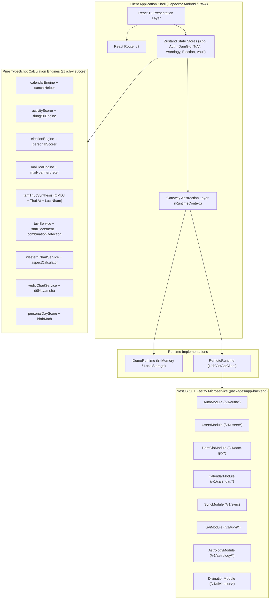

# Technical Architecture - Lich Viet v3

> **Version:** 3.3.0 | **Updated:** August 2026  
> Source of truth for the local codebase, monorepo packages, and modular architecture.

---

## 1. Overview

Lịch Việt is a high-performance, offline-first metaphysical computing application built as a browser SPA, packaged for mobile via Capacitor Android, and backed by an optional NestJS Fastify microservice for cloud synchronization, identity, and server-side calculation verification.

### Active Product Surfaces:

- **Landing:** Standalone introduction, feature showcases, and quick intake.
- **Âm Lịch & Dụng Sự:** Solar/lunar calendar, Can Chi, Tiết Khí, Hoàng Đạo/Hắc Đạo, and personalized day auspiciousness scoring.
- **Sổ Đám Giỗ (Ancestral Anniversaries):** Complete anniversary book with lunar date tracking and multi-day alarm lead times.
- **Ngày Tốt (Electional Astrology):** Auspicious date selection across custom date ranges, activity filters, and personal birth chart compatibility.
- **Gieo Quẻ & Tam Thức:** Divination suite combining Mai Hoa Dịch Số, Kỳ Môn Độn Giáp, Thái Ất Thần Kinh, and Đại Lục Nhâm.
- **Tử Vi Đẩu Số:** Full 12-palace astrological chart generation based on the classical Thiên Lương / Nam Phái traditions, true-solar time correction, and SVG export.
- **Chiêm Tinh Tây Phương (Western Natal & Transits):** High-precision planetary ephemeris, Placidus/Whole Sign houses, aspect matrices, and wheel visualization.
- **Chiêm Tinh Ấn Độ (Vedic & D9 Navamsha):** Sidereal Lahiri calculations, Nakshatras, and South/North Indian square chart layouts.
- **Hợp Lá Số (Synastry):** Cross-chart astrological compatibility and dual-wheel overlays.
- **Support & Settings:** Profile personalization, cloud synchronization & backup, light/dark themes, offline PWA storage, and export management.

---

## 2. Technology Stack

| Layer | Technology | Version | Purpose |
| --- | --- | --- | --- |
| **Frontend Framework** | React + TypeScript | 19.2.x + 5.9.x | Component-driven UI and strict type safety |
| **Build & Bundler** | Vite | 7.3.x | Lightning-fast HMR and optimized production code-splitting |
| **Styling** | Tailwind CSS v4 + Vanilla CSS | 4.2.x | High-performance CSS-first styling and theme tokens |
| **State Management** | Zustand | 5.0.x | Lightweight, decoupled global application state |
| **Routing** | React Router DOM | 7.13.x | Client-side routing, route guards, and code-split lazy loading |
| **Gateway Abstraction** | Custom RuntimeContext | 3.3.x | Seamless toggle between offline local-first demo and live remote backend |
| **Backend Service** | NestJS + Fastify | 11.1.x + 5.2.x | High-throughput HTTP API for Auth, Users, Đám Giỗ, and Sync |
| **Client SDK** | `@lich-viet/api-client` | 3.3.x | Type-safe HTTP client with automatic auth and error handling |
| **Shared Contracts** | `@lich-viet/contracts` | 3.3.x | Zero-dependency TypeScript interfaces and DTOs |
| **Astronomical Ephemeris** | `@swisseph/browser` + `@swisseph/core` | 1.1.x | High-precision planetary positions, true solar time, and solar terms |
| **Export Engine** | `html-to-image` | 1.11.x | Client-side vector SVG and high-resolution chart exports |
| **Mobile Runtime** | Capacitor Android | 8.3.x | Native Android WebView packaging, filesystem, and clipboard |
| **Validation** | Zod | 4.3.x | Schema-driven form validation and API contract assertions |
| **Testing** | Vitest + Node Test Runner + Playwright | 4.0.x / 1.58.x | 100% green unit, engine, gateway, backend E2E, and browser testing |
| **Code Quality** | ESLint 9 (Flat Config) + Prettier 3 | 9.39.x / 3.8.x | Automated linting, accessibility checks, and format enforcement |

---

## 3. High-Level Architecture


```mermaid
graph TB
    subgraph ClientShell["Client Application Shell (Capacitor Android / PWA)"]
        direction TB
        UI["React 19 Presentation Layer"]
        Router["React Router v7"]
        Stores["Zustand State Stores (App, Auth, DamGio, TuVi, Astrology, Election, Vault)"]
        Gateway["Gateway Abstraction Layer (RuntimeContext)"]
    end

    subgraph Runtimes["Runtime Implementations"]
        DemoRuntime["DemoRuntime (In-Memory / LocalStorage)"]
        RemoteRuntime["RemoteRuntime (LichVietApiClient)"]
    end

    subgraph BackendService["NestJS 11 + Fastify Microservice (packages/app-backend)"]
        AuthMod["AuthModule (/v1/auth/*)"]
        UsersMod["UsersModule (/v1/users/*)"]
        DamGioMod["DamGioModule (/v1/dam-gio/*)"]
        CalMod["CalendarModule (/v1/calendar/*)"]
        SyncMod["SyncModule (/v1/sync)"]
        TuViMod["TuViModule (/v1/tu-vi/*)"]
        AstroMod["AstrologyModule (/v1/astrology/*)"]
        DivMod["DivinationModule (/v1/divination/*)"]
    end

    subgraph DomainEngines["Pure TypeScript Calculation Engines (@lich-viet/core)"]
        Calendar["calendarEngine + canchiHelper"]
        DungSu["activityScorer + dungSuEngine"]
        Election["electionEngine + personalScorer"]
        MaiHoa["maiHoaEngine + maiHoaInterpreter"]
        TamThuc["tamThucSynthesis (QMDJ + Thai At + Luc Nham)"]
        TuViEng["tuviService + starPlacement + combinationDetection"]
        WesternEng["westernChartService + aspectCalculator"]
        VedicEng["vedicChartService + d9Navamsha"]
        Personal["personalDayScore + birthMath"]
    end

    UI --> Router
    UI --> Stores
    Stores --> Gateway
    Stores --> DomainEngines
    Gateway --> DemoRuntime
    Gateway --> RemoteRuntime
    RemoteRuntime --> BackendService
```

---

## 4. Engine & Module Directory Structure

```text
src/
├── components/             # UI Components (Feature-Sliced)
│   ├── Astrology/          # Western, Vedic, and Synastry views
│   ├── Calendar/           # Calendar grid, day cells, DamGioModal
│   ├── Election/           # Electional date picker and results
│   ├── GieoQue/            # Mai Hoa and divination views
│   ├── LichDungSu/         # Activity scoring UI
│   ├── MaiHoa/             # Mai Hoa trigram/hexagram renderers
│   ├── TamThuc/            # QMDJ, Thái Ất, Lục Nhâm panels
│   ├── TuVi/               # 12-palace grid and chart export
│   ├── layout/             # AppNav, AppSidebar, MobileDrawer, AppFooter
│   ├── pages/              # Landing, Auth, Settings, Upgrade
│   └── shared/             # Common buttons, cards, inputs, error boundary
├── config/                 # Application and theme configuration
├── data/                   # Static JSON datasets (hexagrams, stars, timezones)
├── gateways/               # Gateway Abstraction Layer
│   ├── bootstrap.ts        # Dynamic runtime bootstrap (demo vs remote)
│   ├── demo/               # In-memory mock gateways for offline execution
│   └── remote/             # HTTP gateways powered by @lich-viet/api-client
├── hooks/                  # Custom React hooks (location, dark mode, titles)
├── i18n/                   # Localization helpers
├── router/                 # Routes, redirects, and constants
├── services/               # Specialized domain and orchestration services
│   ├── astronomy/          # Swiss Ephemeris wrapper and solar math
│   ├── astrology/          # Western & Vedic synthesis engines, dialectical synthesis
│   ├── personalization/    # Birth math and personalized scoring
│   ├── tuvi/               # Complete Tử Vi SCTE engine, palace interpretations, star placement
│   └── storage/            # Offline vault and profile storage
├── stores/                 # Zustand state stores (app, auth, damGio, tuvi, vault)
├── types/                  # Shared TypeScript interfaces
└── utils/                  # Core calculation engines and math helpers

packages/
├── api-client/             # @lich-viet/api-client SDK
├── app-backend/            # @lich-viet/app-backend NestJS Fastify application
├── contracts/              # @lich-viet/contracts shared API DTOs
├── core/                   # @lich-viet/core pure engine exports
├── core-logic/             # Canonical calculation logic
├── canonical-db/           # Static database assets and historical records
├── swisseph-wasm/          # Swiss Ephemeris WASM engine
└── types/                  # @lich-viet/types shared type definitions

test/
├── api-client/             # SDK and live backend integration tests
├── astrology/              # Western, Vedic, Dialectical, and Synastry engine tests
├── components/             # React component tests
├── engines/                # Mathematical engine and golden fixture tests
├── fixtures/               # Test fixtures and chart baselines
├── gateways/               # Gateway abstraction and store integration tests
├── hooks/                  # Custom hook tests
├── services/               # Service integration tests
├── stores/                 # Zustand store tests
└── utils/                  # Utility tests
```

---

## 5. Current Quality & Validation Baseline

| Quality Gate | Command | Result |
| --- | --- | --- |
| **TypeScript Typecheck** | `npm run typecheck` | **Passed (0 errors)** with `strict: true` |
| **Vitest Test Suite** | `npm run test:fe` | **Passed 100 / 100 test files (692 / 692 tests)** |
| **Backend E2E Suite** | `npm run test:backend` | **Passed 4 / 4 test files (22 / 22 tests)** |
| **Total Automated Tests** | `npm test` | **Passed 104 test files (714 / 714 tests, 100% green)** |
| **ESLint & Code Quality** | `npm run lint` | **Passed (0 errors, 0 warnings)** |
| **Production Web Build** | `npm run build:web` | **Passed (Clean Vite + PWA build in ~6.4s)** |
| **Android Debug Build** | `./gradlew assembleDebug` | **Passed (`app-debug.apk`, 11.4 MB)** |
| **Android Release Build** | `./gradlew assembleRelease` | **Passed (`app-release-unsigned.apk`, 9.4 MB)** |
