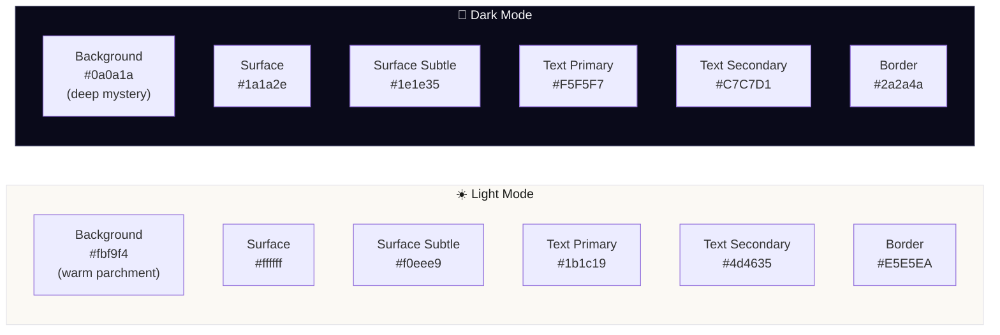

# UI/UX Design System — Lịch Việt v3

> **Version:** 3.0.0 | **Updated:** May 2026
> Complete design system reference covering tokens, components, layout, animations, and accessibility.

---

## 1. Design Philosophy

Lịch Việt v3 follows a **"Mystery & Elegance"** aesthetic — blending Vietnamese cultural gold accents with modern glassmorphism and dark-mode-first design. The UI should feel like consulting a wise, authoritative mentor rather than a generic horoscope app.

### Core Principles

| Principle            | Implementation                                                           |
| -------------------- | ------------------------------------------------------------------------ |
| **Cultural Polish**  | Glassmorphism, gold accents, serif headings                              |
| **Dark-Mode First**  | Rich dark surfaces with purple/blue/gold mystery palette                 |
| **Mobile-First**     | Touch-optimized, responsive breakpoints, drawer navigation               |
| **Accessibility**    | WCAG 2.1 AA, reduced motion support, skip-nav, ARIA labels               |
| **Cultural Respect** | Vietnamese terminology, traditional color associations, serif typography |

---

## 2. Color Palette

### 2.1 Core Colors



### 2.2 Semantic Colors

| Token                      | Light     | Dark      | Usage                                     |
| -------------------------- | --------- | --------- | ----------------------------------------- |
| `--color-primary`          | `#007AFF` | `#0A84FF` | Links, active states, CTAs                |
| `--color-good`             | `#059669` | `#34D399` | Auspicious, positive indicators           |
| `--color-bad`              | `#DC2626` | `#F87171` | Inauspicious, warnings                    |
| `--color-gold`             | `#775a13` | `#ffdea1` | Cultural accent, highlights, and emphasis |
| `--color-gold-light`       | `#d4ae60` | —         | Decorative gold                           |
| `--color-calendar-today`   | `#007AFF` | —         | Today indicator                           |
| `--color-calendar-weekend` | `#FF3B30` | —         | Weekend/holiday indicator                 |

### 2.3 Mystery Palette (Dark Mode Exclusive)

| Token                       | Value                   | Usage                   |
| --------------------------- | ----------------------- | ----------------------- |
| `--color-mystery-deep`      | `#0a0a1a`               | Deepest background      |
| `--color-mystery-surface`   | `#1a1a2e`               | Card surfaces           |
| `--color-mystery-purple`    | `#7c3aed`               | Primary mystical accent |
| `--color-mystery-blue`      | `#2563eb`               | Secondary accent        |
| `--color-mystery-teal`      | `#0d9488`               | Tertiary accent         |
| `--color-mystery-glow`      | `rgba(124,58,237,0.15)` | Ambient glow effects    |
| `--color-mystery-glow-gold` | `rgba(212,168,67,0.12)` | Gold glow effects       |

### 2.4 Hexagram Accent Colors

| Token            | Purpose                             |
| ---------------- | ----------------------------------- |
| `accent-main`    | Bản Quẻ (Main hexagram) — Blue      |
| `accent-mutual`  | Hổ Quẻ (Mutual hexagram) — Purple   |
| `accent-changed` | Biến Quẻ (Changed hexagram) — Teal  |
| `accent-moving`  | Hào Động (Moving line) — Amber/Gold |

---

## 3. Typography

### Font Stack

| Role                   | Font       | Fallback                 | CSS Variable     |
| ---------------------- | ---------- | ------------------------ | ---------------- |
| **Display / Headings** | Noto Serif | Georgia, Times New Roman | `--font-display` |
| **Body / UI**          | Noto Sans  | system-ui, sans-serif    | `--font-sans`    |

### Type Scale

| Class                | Properties                                      | Usage                     |
| -------------------- | ----------------------------------------------- | ------------------------- |
| `.page-title`        | `text-xl`, bold, tight tracking                 | Page headings (H1)        |
| `.section-title`     | `text-lg`, semibold, tight tracking             | Section headings (H2)     |
| `.sub-section-title` | `text-base`, semibold, tight tracking           | Sub-section headings (H3) |
| `.label-standard`    | `text-[10px]`, bold, uppercase, widest tracking | Category labels           |

### Font Size Control

Users can cycle through 3 font size levels via `appStore.cycleFontSize()`:

| Level    | Base Size | Usage                       |
| -------- | --------- | --------------------------- |
| `small`  | 14px      | Compact display             |
| `normal` | 16px      | Default                     |
| `large`  | 18px      | Accessibility / readability |

---

## 4. Surface System

### 4.1 Glass Card Variants

```
┌─────────────────────────────────────────────────┐
│  .glass-card                                     │
│  ─────────────────────────────────────────────── │
│  Light: white 95% opacity, subtle shadow         │
│  Dark:  #1a1a2e 55% opacity, blur(20px),        │
│         purple glow inset, gradient border       │
│  Hover: deepened shadow + glow                   │
└─────────────────────────────────────────────────┘

┌─────────────────────────────────────────────────┐
│  .glass-card-strong                              │
│  ─────────────────────────────────────────────── │
│  Stronger opacity (70%), deeper blur (24px)      │
│  For prominent sections and hero cards           │
└─────────────────────────────────────────────────┘

┌─────────────────────────────────────────────────┐
│  .card-surface (legacy compat)                   │
│  ─────────────────────────────────────────────── │
│  Solid background with blur backdrop in dark     │
└─────────────────────────────────────────────────┘
```

### 4.2 Utility Card Classes

| Class             | Purpose                                           |
| ----------------- | ------------------------------------------------- |
| `.card-subtle`    | Muted background container for nested content     |
| `.card-subtle-sm` | Compact inline/grid items (max-width: 140px)      |
| `.card-quote`     | Left-border amber quote block                     |
| `.card-highlight` | Amber-tinted highlight block with rounded corners |
| `.card-header`    | Standardized card top section with subtle bg      |

### 4.3 Shadow System

| Class                                                 | Effect                                   |
| ----------------------------------------------------- | ---------------------------------------- |
| `.shadow-apple`                                       | Soft multi-layer shadow (Apple-inspired) |
| `.shadow-apple-hover`                                 | Elevated hover shadow                    |
| Dark mode variants automatically apply deeper shadows |

---

## 5. Glassmorphism & Effects

### 5.1 Glass Navigation

```css
.glass-nav {
  /* Light: white 85% + blur(20px) */
  /* Dark: deep 70% + blur(24px) + purple border glow */
}
```

### 5.2 Mystery Glow Border

On hover (dark mode only), cards get a gradient border glow:

- Purple → Gold → Blue gradient
- Uses CSS mask-composite for edge-only rendering
- Smooth 0.4s fade-in transition

### 5.3 Liquid Glass Enhancements

| Effect               | Class                | Description                                                |
| -------------------- | -------------------- | ---------------------------------------------------------- |
| **Gradient Divider** | `.divider-fade`      | Replaces solid borders with purple→gold→blue gradient fade |
| **Nav Glass Pill**   | `.nav-glass-pill`    | Active tab indicator with glass effect                     |
| **Hover Depth**      | `.hover-depth`       | Deepened blur and shadow on hover                          |
| **Text Shadow**      | `.glass-text-shadow` | Subtle shadow for readability on glass                     |

---

## 6. Animation System

### 6.1 Entrance Animations

| Class                 | Animation                                | Duration | Easing                      |
| --------------------- | ---------------------------------------- | -------- | --------------------------- |
| `.animate-fade-in-up` | Fade + translateY(16px→0)                | 450ms    | cubic-bezier(0.22,1,0.36,1) |
| `.animate-scale-in`   | Fade + scale(0.95→1)                     | 300ms    | cubic-bezier(0.22,1,0.36,1) |
| `.animate-slide-down` | Fade + translateY(-8px→0)                | 250ms    | cubic-bezier(0.22,1,0.36,1) |
| `.animate-slide-up`   | Fade + translateY(12px→0)                | 350ms    | cubic-bezier(0.22,1,0.36,1) |
| `.animate-fade-scale` | Fade + scale(0.97→1) + translateY(6px→0) | 400ms    | cubic-bezier(0.22,1,0.36,1) |

### 6.2 Stagger Delays

Classes `.animate-delay-1` through `.animate-delay-8` provide 80ms-increment stagger delays (80ms → 640ms) for sequential card/list animations.

### 6.3 Interactive Micro-Animations

| Class           | Effect                                      |
| --------------- | ------------------------------------------- |
| `.hover-lift`   | translateY(-2px) + elevated shadow on hover |
| `.hover-scale`  | scale(1.03) on hover                        |
| `.press-scale`  | scale(0.97) on active (press feedback)      |
| `.btn-interact` | translateY(-1px) hover + scale(0.97) active |

### 6.4 Smooth Collapse/Expand

```css
.collapse-grid[data-open="true"]  → grid-template-rows: 1fr
.collapse-grid[data-open="false"] → grid-template-rows: 0fr
```

350ms cubic-bezier transition for smooth accordion behavior.

---

## 7. Component Inventory

### 7.1 Layout Components (4)

| Component      | File                      | Responsibility                   |
| -------------- | ------------------------- | -------------------------------- |
| `AppNav`       | `layout/AppNav.tsx`       | Top navigation bar               |
| `AppSidebar`   | `layout/AppSidebar.tsx`   | Calendar sidebar and day summary |
| `MobileDrawer` | `layout/MobileDrawer.tsx` | Mobile navigation drawer         |
| `AppFooter`    | `layout/AppFooter.tsx`    | Footer with version/links        |

### 7.2 Shared Components

| Category         | Components                                              |
| ---------------- | ------------------------------------------------------- |
| **Data Display** | `EngineTabNav`, `SynergyRadar`, `LoadingState`          |
| **Navigation**   | `AppNav`, `MobileDrawer` controls                       |
| **Input**        | `HeroBirthdayInput`, `ActivityPicker`                   |
| **Feedback**     | `LoadingState`, `ErrorState`, `SuccessToast`            |
| **Content**      | `CollapsibleCard`, `FAQIntentCards`, `AcademicCitation` |
| **Visual**       | `MonthCalendar`, `DayCell`, `DetailedDayView`           |

### 7.3 Feature Module Components

| Module        | Key Components                                            |
| ------------- | --------------------------------------------------------- |
| `Calendar/`   | Month grid, day cells, lunar event surfaces               |
| `GieoQue/`    | Mai Hoa and Tam Thuc workspace                            |
| `LichDungSu/` | Activity calendar, score cards, QMDJ widget               |
| `MaiHoa/`     | Hexagram display, trigram analysis                        |
| `TamThuc/`    | QMDJ, Thai At, and Luc Nham synthesis                     |
| `pages/`      | Landing, Âm Lich, auth, settings, upgrade page components |
| `shared/`     | Reusable components (see above)                           |

---

## 8. Responsive Breakpoints

| Breakpoint    | Target        | Behavior                             |
| ------------- | ------------- | ------------------------------------ |
| `< 640px`     | Small mobile  | Single column, stacked cards         |
| `640-767px`   | Large mobile  | Slightly wider cards                 |
| `768-1023px`  | Tablet        | 2-column grids, icon-only sidebar    |
| `1024-1399px` | Small desktop | Full sidebar + content               |
| `≥ 1400px`    | Large desktop | `max-width: 1400px` centered content |

### Detection Hook

```typescript
const isMobile = useIsMobile(); // true when viewport < 768px
```

---

## 9. Feature-Specific CSS Modules

| File              | Size | Scope                                             |
| ----------------- | ---- | ------------------------------------------------- |
| `fonts.css`       | 2KB  | @font-face for self-hosted Noto Sans + Noto Serif |
| `lunar-event.css` | 6KB  | Calendar event markers, holiday indicators        |

---

## 10. Accessibility (A11y)

### WCAG 2.1 AA Compliance

| Feature                 | Implementation                                                    |
| ----------------------- | ----------------------------------------------------------------- |
| **Skip Navigation**     | `<a href="#main-content">` skip link (sr-only → visible on focus) |
| **Focus Indicators**    | 2px blue outline with 2px offset on `:focus-visible`              |
| **Color Contrast**      | All text meets 4.5:1 ratio; dark mode form inputs enhanced        |
| **Reduced Motion**      | `@media (prefers-reduced-motion: reduce)` disables all animations |
| **ARIA Labels**         | `<main aria-label="Nội dung chính">`, nav landmarks               |
| **Semantic HTML**       | Single `<h1>` per page, proper heading hierarchy                  |
| **Keyboard Navigation** | All interactive elements focusable and operable via keyboard      |

### Reduced Motion Handling

When `prefers-reduced-motion: reduce`:

- All ambient animations → `animation: none`
- Entrance animations → `0.01ms` duration (instant appear)
- Hover transforms → `transform: none` (no movement)

---

## 11. Dark Mode Implementation

### Toggle Mechanism

```typescript
// appStore.ts
toggleDarkMode() → adds/removes class "dark" on <html>
                 → persists to localStorage.theme
```

### CSS Strategy

- Tailwind v4 `@custom-variant dark (&:is(.dark *))` for all utility classes
- Custom CSS uses `.dark .class-name {}` pattern for component overrides
- `darkModeInit.js` in `<head>` prevents FOUC (Flash of Unstyled Content)

### Dark Mode Body Background

Multi-layered radial gradient creating the "mystery" atmosphere:

```css
.dark body {
  background:
    radial-gradient(ellipse at 20% 30%, purple 0.06, transparent 70%),
    radial-gradient(ellipse at 80% 70%, blue 0.05, transparent 70%),
    radial-gradient(ellipse at 50% 50%, gold 0.03, transparent 60%), #0a0a1a;
}
```

---

## 12. Day Cell Visual System

### Calendar Day Indicators

| Indicator        | Visual                                | Implementation              |
| ---------------- | ------------------------------------- | --------------------------- |
| **Today**        | Gold border (2px) + dark mode glow    | `.day-cell-today::after`    |
| **Selected**     | Gray border (2px)                     | `.day-cell-selected::after` |
| **Weekend**      | Red text (`--color-calendar-weekend`) | Inline style                |
| **Holiday**      | Marker icon + event label             | `lunar-event.css`           |
| **Auspicious**   | Green indicator                       | Score-based coloring        |
| **Inauspicious** | Red indicator                         | Score-based coloring        |

---

## 13. Common Design Elements Audit

The project does have a shared common design language, and it is both designed and implemented in the source tree.

| Element                | Status                 | Evidence                                                                                                              |
| ---------------------- | ---------------------- | --------------------------------------------------------------------------------------------------------------------- |
| Design tokens          | Designed + implemented | `src/index.css` defines the color palette, Noto font stack, and semantic tokens for light/dark modes.                 |
| Surface system         | Designed + implemented | `glass-card`, `glass-card-strong`, `card-surface`, `card-header`, and `card-subtle` provide reusable card treatments. |
| Typography hierarchy   | Designed + implemented | `page-title`, `section-title`, `sub-section-title`, and `label-standard` standardize text hierarchy across modules.   |
| Navigation chrome      | Designed + implemented | `AppNav` uses `glass-nav` and `nav-glass-pill` for consistent top-level navigation styling.                           |
| Feedback states        | Designed + implemented | `LoadingState`, `ErrorState`, and `SuccessToast` cover the shared UX states.                                          |
| Motion system          | Designed + implemented | Entrance and interaction utilities are defined in `src/index.css`, with reduced-motion overrides included.            |
| Calendar indicators    | Designed + implemented | `day-cell-today` and `day-cell-selected` encode the common day-state visuals.                                         |
| Accessibility baseline | Designed + implemented | Focus-visible styling, semantic landmarks, and reduced-motion handling are already present.                           |

Conclusion: the project already has a coherent shared design system, so new UI work should reuse the established tokens, cards, and feedback components rather than introducing ad-hoc styling.

---

> **Note:** This design system is the authoritative reference for all UI work. New components should use the established token system and card variants rather than ad-hoc styling. When in doubt, reference `src/index.css` for the complete token definitions.
