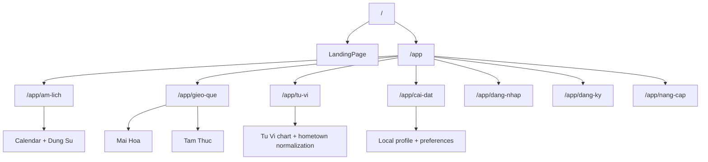

# User Flow Reference - Lich Viet v3

> **Version:** 3.0.0 | **Updated:** May 2026
> Current navigation and user-flow reference for the active v3 app.

---

## 1. Route Map

| Route | Status | Destination |
| --- | --- | --- |
| `/` | Active | Landing |
| `/app/am-lich` | Active | Calendar, Dung Su, holidays, and personalization panels |
| `/app/gieo-que` | Active | Mai Hoa and Tam Thuc |
| `/app/tu-vi` | Active | Tu Vi charting |
| `/app/cai-dat` | Active | Settings |
| `/app/dang-nhap` | Active | Demo login |
| `/app/dang-ky` | Active | Demo registration |
| `/app/nang-cap` | Placeholder | Coming-soon pricing / upgrade |

Removed legacy routes redirect to active v3 pages. Tu Vi is no longer a removed surface.

---

## 2. Primary Flows

### Landing

1. User lands on `/`.
2. User sees the current product positioning and may enter birthday/date data.
3. Primary app entry routes to `/app/am-lich`.
4. Landing page birthday flows can seed Tu Vi or related date-aware journeys.

### Am Lich

1. User opens `/app/am-lich`.
2. Sidebar calendar controls the selected date.
3. If browser location is granted, the calendar uses viewer geolocation for lunar calculations and the current-day shortcut.
4. The page shows lunar date details, auspicious hours, activity guidance, holidays, and related panels.
5. Holiday cards still use Geo-IP lookup to determine whether to add local-country holidays.
6. Authenticated users with birthday data can see personalization signals.

### Gieo Que

1. User opens `/app/gieo-que`.
2. User chooses Mai Hoa or Tam Thuc.
3. Mai Hoa supports time-based and number-based divination.
4. Tam Thuc synthesizes QMDJ, Luc Nham, and Thai At from the selected time.

### Tu Vi

1. User opens `/app/tu-vi`.
2. User enters birth date, birth time, gender, and birthplace.
3. Birthplace coordinates and timezone are normalized in the Tu Vi birth context.
4. When Swiss ephemeris is available, true-solar correction is applied using birthplace longitude.
5. The page renders chart data, hạn controls, palace selection, and export helpers.

### Settings

1. User opens `/app/cai-dat`.
2. User adjusts theme, font size, profile data, and local demo-account settings.
3. Settings persist in localStorage.

---

## 3. Authentication Boundary

Auth is demo-only and stored in browser localStorage. It supports:

| Flow | Notes |
| --- | --- |
| Register | Creates a local browser account |
| Login | Checks local browser account credentials |
| Social login | Simulated locally |
| Profile update | Updates local user profile data |
| Change password | Uses salted SHA-256 hashes for local demo credentials |

A seeded demo admin account is created for local testing, but there is no active admin route, no production session layer, and no live 2FA flow.

---

## 4. Legacy Redirects

| Removed surface | Current behavior |
| --- | --- |
| `/tu-vi` | Redirects to `/app/tu-vi` |
| `/am-lich` | Redirects to `/app/am-lich` |
| `/gieo-que` | Redirects to `/app/gieo-que` |
| `/lich-dung-su` | Redirects to `/app/am-lich` |
| `/phong-thuy` | Redirects to `/app/am-lich` |
| `/bat-tu` | Redirects to `/app/am-lich` |
| `/chiem-tinh` | Redirects to `/app/am-lich` |
| `/than-so-hoc` | Redirects to `/app/am-lich` |
| `/hop-la` | Redirects to `/app/am-lich` |
| `/luc-nham` | Redirects to `/app/gieo-que?method=tam-thuc` |

Removed business features such as premium gating, credits, PDF export, onboarding tours, and widget pages are still absent from the active app.

---

## 5. Validation Baseline

Current local validation:

| Check | Status |
| --- | --- |
| `npm run typecheck` | Pass |
| `npm run lint` | Pass with one pre-existing warning in `src/components/DetailedDayView.tsx` |
| `npm test` | Pass |
