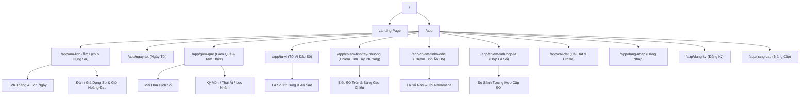

# User Flow Reference - Lich Viet v3

> **Version:** 3.1.0 | **Updated:** August 2026  
> Navigation architecture and user journey specifications.

---

## 1. Application Navigation Hierarchy

```mermaid
flowchart TD
    HOME["/"] --> LANDING["Landing Page"]
    HOME --> APP["/app"]
    
    APP --> AMLICH["/app/am-lich (Âm Lịch & Dụng Sự)"]
    APP --> NGAYTOT["/app/ngay-tot (Ngày Tốt)"]
    APP --> GIEOQUE["/app/gieo-que (Gieo Quẻ & Tam Thức)"]
    APP --> TUVI["/app/tu-vi (Tử Vi Đẩu Số)"]
    APP --> WESTERN["/app/chiem-tinh/tay-phuong (Chiêm Tinh Tây Phương)"]
    APP --> VEDIC["/app/chiem-tinh/vedic (Chiêm Tinh Ấn Độ)"]
    APP --> SYNASTRY["/app/chiem-tinh/hop-la (Hợp Lá Số)"]
    APP --> SETTINGS["/app/cai-dat (Cài Đặt & Profile)"]
    APP --> LOGIN["/app/dang-nhap (Đăng Nhập)"]
    APP --> REGISTER["/app/dang-ky (Đăng Ký)"]
    APP --> UPGRADE["/app/nang-cap (Nâng Cấp)"]

    AMLICH --> CALENDAR["Lịch Tháng & Lịch Ngày"]
    AMLICH --> DUNGSU["Đánh Giá Dụng Sự & Giờ Hoàng Đạo"]
    GIEOQUE --> MAIHOA["Mai Hoa Dịch Số"]
    GIEOQUE --> TAMTHUC["Kỳ Môn / Thái Ất / Lục Nhâm"]
    TUVI --> TUVIGRAPH["Lá Số 12 Cung & An Sao"]
    WESTERN --> WESTERNWHEEL["Biểu Đồ Tròn & Bảng Góc Chiếu"]
    VEDIC --> VEDICSQUARE["Lá Số Rasi & D9 Navamsha"]
    SYNASTRY --> DUALCHART["So Sánh Tương Hợp Cặp Đôi"]
```

---

## 2. Primary User Journeys

### A. Âm Lịch & Dụng Sự (`/app/am-lich`)
1. **Intake & Location Detection:** Automatically requests viewer geolocation to align lunar month transitions and solar terms with local civil time.
2. **Month Overview:** Full grid view showing solar/lunar dates, solar terms (Tiết Khí), and holiday badges.
3. **Day Detail & Auspicious Guidance:** Displays Can Chi for Year/Month/Day/Hour, Auspicious Hours (Giờ Hoàng Đạo), and specific activity scores (Xuất hành, Khai trương, Động thổ, Cưới hỏi).
4. **Personalized Overlay:** If the user's birth year is saved, applies personalized harmony/conflict scores (Tam Hợp, Lục Xung, Thái Tuế).

### B. Ngày Tốt / Auspicious Date Search (`/app/ngay-tot`)
1. **Filter Selection:** User selects target activity (e.g. Khai trương, Cưới hỏi, Mua xe) and search date window.
2. **Evaluation & Ranking:** Scans all dates in range against activity rules, 28 mansions, and 12 Directing Officers.
3. **Personalized Ranking:** Factors in the user's birth data to surface the most auspicious dates with zero conflict.

### C. Gieo Quẻ & Tam Thức (`/app/gieo-que`)
1. **Mai Hoa Divination:**
   - **Time-based casting:** Instantly generates Initial, Mutual, and Transformed hexagrams based on current or custom time.
   - **Number-based casting:** Accepts two user-entered numbers to derive upper/lower trigrams and changing lines.
2. **Tam Thức Suite:**
   - Single tabbed interface toggling between **Kỳ Môn Độn Giáp** (9-palace board), **Thái Ất Thần Kinh** (cyclical fortune), and **Đại Lục Nhâm** (Heaven/Earth plates & 4 Lessons).

### D. Tử Vi Đẩu Số (`/app/tu-vi`)
1. **Birth Data Entry:** Name, solar birth date, birth hour, gender, and birthplace.
2. **Astronomical Normalization:** Applies historical Vietnam timezone corrections (1906–present) and true-solar time correction via Swiss Ephemeris.
3. **Chart Exploration:** Interactive 12-palace chart with main stars, auxiliary rings, brightness indicators, and Hạn timeline.
4. **Export:** High-resolution SVG and vector image generation via `html-to-image`.

### E. Western & Vedic Astrology (`/app/chiem-tinh/*`)
1. **Western Natal Chart:** Interactive SVG chart wheel showing planetary longitudes, house cusps (Placidus default), and aspect lines.
2. **Vedic Astrology:** North and South Indian square chart layouts with sidereal Lahiri ayanamsha, Nakshatra lords, and D9 Navamsha.
3. **Synastry:** Dual chart overlay comparing two birth charts with composite aspect matrices and relationship harmony indices.

---

## 3. Mobile Navigation Patterns

- **Bottom Tab Bar (`<MobileTabBar>`):** Persistent on mobile viewports (< 768px) with safe-area padding. Enables instant 1-tap switching between primary features:
  1. Âm Lịch (`/app/am-lich`)
  2. Ngày Tốt (`/app/ngay-tot`)
  3. Tử Vi (`/app/tu-vi`)
  4. Chiêm Tinh (`/app/chiem-tinh`)
  5. Gieo Quẻ (`/app/gieo-que`)
- **App Navigation & Quick Drawer (`<AppNav>`, `<MobileDrawer>`):** Provides access to secondary destinations (Cài Đặt, Giới Thiệu, Trợ Giúp, Nâng Cấp, Đăng Nhập).
- **User Preferences Menu (`<UserMenu>`):** Floating popover providing 1-click font size scaling, dark mode toggle, and account status.

---

## 4. Storage & Offline Protocol

- **Zero-Backend Guarantee:** All profile data, preferences, and custom charts remain securely inside the client browser (`localStorage` and IndexedDB).
- **Service Worker Precaching:** All application assets, fonts, and Swiss Ephemeris WASM files are precached for offline functionality.
